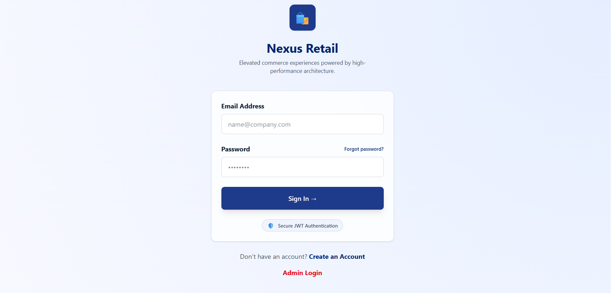
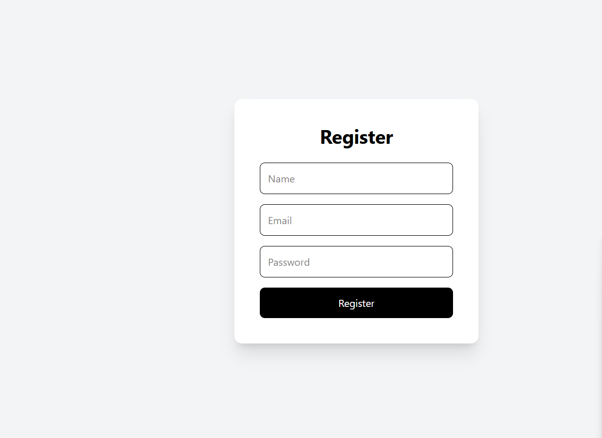
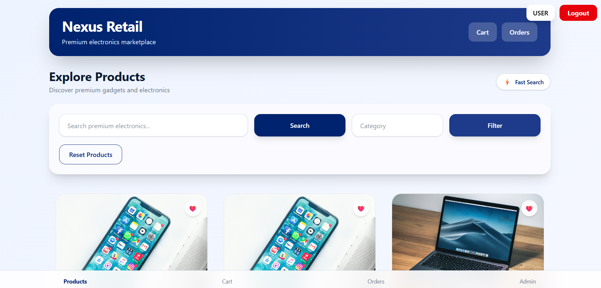
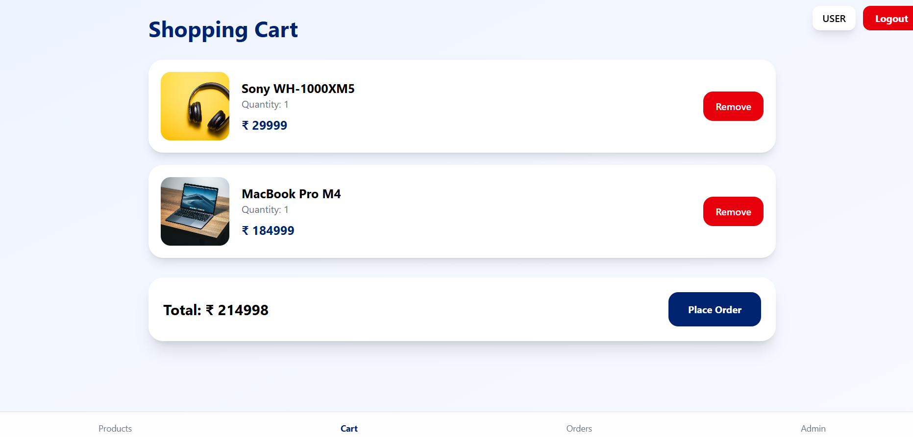
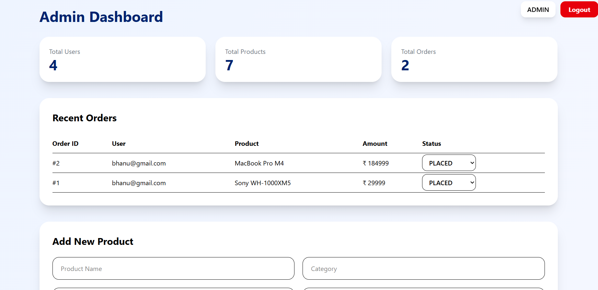
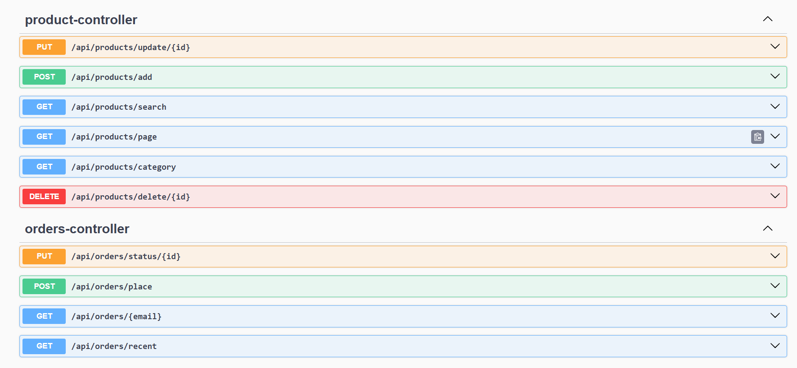

# Nexus Retail - Full Stack E-Commerce Platform

Live Demo:  
https://smart-ecommerce-platform-xi.vercel.app

Backend API:  
https://smart-ecommerce-platform-zj7d.onrender.com

Swagger Documentation:  
https://smart-ecommerce-platform-zj7d.onrender.com/swagger-ui.html

---

## Project Overview

Nexus Retail is a full stack e-commerce platform built using React, Spring Boot, MySQL, JWT Authentication, Docker, and cloud deployment platforms.

The application supports user authentication, admin authentication, product management, cart management, order management, payment simulation, admin analytics, and cloud deployment.

---

## Tech Stack

### Frontend
- React.js
- Axios
- CSS
- Vercel

### Backend
- Spring Boot
- Spring Security
- JWT Authentication
- BCrypt Password Encryption
- Spring Data JPA
- Hibernate
- REST APIs

### Database
- MySQL
- Railway Cloud Database

### DevOps
- Docker
- Render
- GitHub

---

## Features

### User Features
- User registration
- User login
- Browse products
- Search products
- Filter products by category
- Add products to cart
- Remove products from cart
- Place orders
- View order history

### Admin Features
- Admin login
- Add products
- Update products
- Delete products
- View admin analytics
- View recent orders
- Update order status

---

## Screenshots

### Login Page


### Register Page


### Products Page


### Cart Page


### Admin Dashboard


### Swagger API


---

## System Architecture

```text
React Frontend
      |
      | Axios API Calls
      |
Spring Boot Backend
      |
      | JWT Authentication
      | Role Based Authorization
      |
MySQL Database
```

Deployment:

```text
Frontend  → Vercel
Backend   → Render
Database  → Railway MySQL
```

---

## Authentication Flow

- User registers using name, email, and password.
- Password is encrypted using BCrypt.
- User logs in using email and password.
- Backend validates credentials.
- JWT token is generated after successful login.
- JWT token and role are stored in browser localStorage.
- Axios interceptor sends JWT token with API requests.
- Backend validates token before protected API access.
- Admin APIs are accessible only for ADMIN role.

---

## Security Features

- JWT Authentication
- Role Based Authorization
- BCrypt Password Encryption
- Protected Admin APIs
- Protected Frontend Routes
- Centralized Axios API Configuration

---

## API Endpoints

### Authentication
- POST `/api/auth/register`
- POST `/api/auth/login`

### Products
- GET `/api/products/page`
- GET `/api/products/search`
- GET `/api/products/category`
- POST `/api/products/add`
- PUT `/api/products/update/{id}`
- DELETE `/api/products/delete/{id}`

### Cart
- POST `/api/cart/add`
- GET `/api/cart/{email}`
- DELETE `/api/cart/delete/{id}`

### Orders
- POST `/api/orders/place`
- GET `/api/orders/{email}`
- GET `/api/orders/recent`
- PUT `/api/orders/status/{id}`

### Payment
- POST `/api/payment/pay`

### Admin
- GET `/api/admin/stats`

---

## Docker Commands

Build backend Docker image:

```bash
docker build -t ecommerce-backend .
```

Run backend Docker container:

```bash
docker run -p 8080:8080 ecommerce-backend
```

---

## Local Setup

### Backend

```bash
cd ecommerce-backend
./gradlew bootRun
```

Backend runs on:

```text
http://localhost:8080
```

### Frontend

```bash
cd frontend
npm install
npm run dev
```

Frontend runs on:

```text
http://localhost:5173
```

---

## Deployment

### Frontend
Deployed on Vercel.

### Backend
Deployed on Render.

### Database
Hosted on Railway MySQL.

---

## Resume Highlights

- Built and deployed a full stack e-commerce platform using React, Spring Boot, and MySQL.
- Implemented JWT Authentication, BCrypt password encryption, and Role Based Authorization.
- Developed user and admin dashboards with product management, cart, orders, and analytics.
- Integrated Railway MySQL cloud database with Spring Data JPA and Hibernate.
- Deployed frontend on Vercel and backend on Render.
- Dockerized backend application for containerized deployment.
- Created REST APIs with Swagger documentation.
- Implemented centralized Axios API configuration with JWT token interceptor.

---

## Future Improvements

- Razorpay payment integration
- Wishlist system
- Email notifications
- Cloudinary image upload
- Redis caching
- CI/CD pipeline
- Order invoice PDF generation
- Product recommendation system

---

## Author

Anushree Naidu